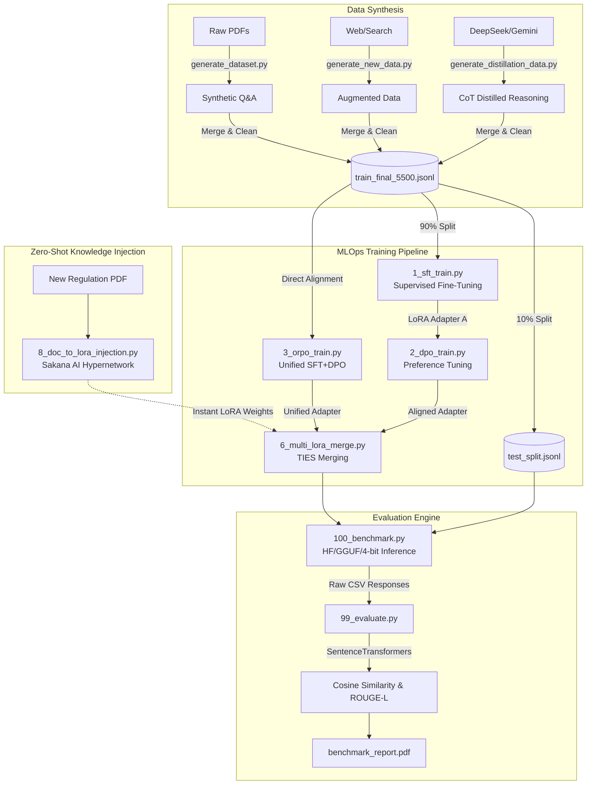

# Bank SLM Benchmark & Distillation

A comprehensive suite for **Benchmarking**, **Distilling**, and **Fine-Tuning** Small Language Models (SLMs) specifically for the banking domain. This project unifies standard performance metrics with advanced knowledge distillation workflows and financial reasoning datasets.

---

## 🚀 Key Features

### 1. Unified Benchmarking Engine (`src/benchmark.py`)
- **Multi-Format Dataset Support**: Seamlessly reads `.json` and `.jsonl` files, dynamically handling varying schema keys (e.g., `prompt`, `instruction`, `query`).
- **Multi-Framework Support**: Seamlessly benchmark Hugging Face (HF) transformers and GGUF models.
- **Hardware Acceleration**: Automatic detection and utilization of **Apple Silicon Metal (MPS)**, **NVIDIA CUDA**, or CPU.
- **Quantization Support**: Test models in `float16` or `int4` (via `bitsandbytes`) to analyze the accuracy vs. performance trade-offs.
- **Batch Processing**: Automated timestamped results management with a "latest" symlink for easy access.

### 2. Preference Tuning (DPO/ORPO) Integration
- **Alignment with Human Preferences**: Direct Preference Optimization (DPO) and Odds Ratio Preference Optimization (ORPO) to align SLMs with desired response formats.
- **Reference-Free Alignment**: ORPO support for unified SFT+Preference tuning without needing a frozen reference model.
- **Synthetic Preference Data**: Automated generation of 'rejected' answers via Gemini API.

### 3. Zero-Shot Knowledge Injection (`src/8_doc_to_lora_injection.py`)
- **Hypernetwork Prediction**: Instantly inject factual knowledge from new PDFs into model weights without iterative fine-tuning.
- **Sakana AI Doc-to-LoRA**: Implementation of cutting-edge weight-prediction methodology for near-instant compliance updates.

### 4. End-to-End Automation (`run_pipeline.sh`)
- **Single-Command Execution**: Orchestrates the entire workflow: **SFT -> DPO -> ORPO -> Merging -> Benchmarking -> Eval -> Zero-Shot Injection**.
- **Fully Parameterized**: Easily switch base models (TinyLlama, Qwen, Gemma) and datasets via top-level variables.
- **Automated Data Splitting**: SFT training automatically creates an unseen 90/10 split for unbiased benchmarking.

### 5. Specialized Financial Datasets
- **Bank Queries (Primary)**: 195 hand-crafted queries covering Cards, Accounts, Security, and Loans.
- **Distilled Reasoning**: Chain-of-Thought (CoT) data generated by DeepSeek-V3/R1.
- **PDF to SFT**: Turn technical banking PDFs (MiCA, Data Act) into structured Q&A pairs.

### 6. Academic Documentation (`ACADEMIC/`)
- **PhD-Level Thesis**: A 10-chapter LaTeX document detailing the mathematical paradigms of the entire MLOps framework.

---

## 🏗️ Pipeline Architecture Flow



---

## 📂 Project Structure

```text
├── data/
│   ├── bank_queries.json            # Primary test set (195 queries)
│   ├── finqa/                       # FinQA Dataset (numerical reasoning)
│   ├── distilled_training_data.json # Teacher-generated CoT training data
│   ├── banking77_full.json          # Intent detection dataset (13k queries)
│   ├── raw_pdfs/                    # Source technical documents (MiCA, Data Act)
│   ├── pdf_synthetic_dataset.jsonl  # Q&A pairs extracted from PDFs
│   ├── new_search_dataset.jsonl     # New data from Google Search (DORA, PSD3, TFR)
│   └── train_final_5500.jsonl       # Final merged dataset (5,500+ entries) for SFT
├── src/
│   ├── 1_sft_train.py               # Supervised Fine-Tuning (SFT) script
│   ├── 2_dpo_train.py               # Direct Preference Optimization (DPO) script
│   ├── 3_orpo_train.py              # Odds Ratio Preference Optimization (ORPO) script
│   ├── 6_multi_lora_merge.py        # Utility to merge multiple domain-specific LoRAs
│   ├── 7_hyperparameter_sweep.py    # LoRA hyperparameter testing utility
│   ├── 99_evaluate.py               # Scoring & PDF Report generation
│   ├── 100_benchmark.py             # Main benchmarking entry point
│   └── utils/                       # Downloaders & Dataset converters
│       ├── generate_distillation_data.py # DeepSeek Teacher simulation
│       ├── generate_new_data.py          # Internet/Search data generator
│       └── augment_dataset.py            # 10x Dataset Augmenter
├── models/                          # Local storage for GGUF & Adapters
└── results/                         # Raw CSV logs, Plots, and PDF reports
```

---

## 🛠️ Installation & Setup

1. **Install Dependencies**:
   ```bash
   pip install -r requirements.txt
   ```

2. **Mac Optimization (Highly Recommended)**:
   For local GGUF support with Metal acceleration:
   ```bash
   CMAKE_ARGS="-DLLAMA_METAL=on" pip install llama-cpp-python --upgrade --force-reinstall --no-cache-dir
   ```

3. **Data Preparation**:
   ```bash
   # Download public datasets
   python src/utils/download_finqa.py
   python src/utils/download_banking77.py
   
   # Generate synthetic & augmented data
   python src/utils/generate_dataset.py       # From PDFs
   python src/utils/generate_new_data.py      # From Internet/Search
   python src/utils/augment_dataset.py        # 10x Augmentation
   ```

4. **API Keys**:
   Create a `.env` file in the root directory:
   ```env
   HF_TOKEN=your_token
   GEMINI_API_KEY=your_key
   ```

---

## 📖 Detailed Usage Guide

### Phase 1: Data Preparation & Distillation
Before training or benchmarking, you need high-quality data. This project utilizes a multi-source data pipeline:

#### 1. Knowledge Distillation (Teacher-to-Student)
This method uses a high-capacity "Teacher" model (DeepSeek-V3 or Gemini) to generate high-quality responses and reasoning paths.
- **Goal**: Teach a small model *how* to reason via Chain-of-Thought (CoT).
- **Process**: Runs through `data/bank_queries.json` and generates reasoning + final answers.
- **Output**: `data/distilled_training_data.json`

```bash
python src/utils/generate_distillation_data.py
```

#### 2. Domain Specialization (PDF & Internet Search)
Turn technical banking documents and recent regulatory updates into structured Q&A pairs.
- **PDF Extraction**: Converts `data/raw_pdfs/` (MiCA, Data Act) into structured Q&A.
- **Internet Search**: Uses Google Search to fetch information on the latest regulations (DORA, PSD3, TFR).
- **Scripts**: `src/utils/generate_dataset.py` and `src/utils/generate_new_data.py`.

#### 3. Dataset Augmentation (`src/utils/augment_dataset.py`)
Expand your synthetic or search-based datasets by generating 10 variations for each query.
- **Goal**: Improve model robustness by training on different tones (Formal, Casual, Technical) and roles (Compliance Officer, End User).
- **Output**: Multiplies your dataset size by 10x (e.g., from 500 to 5,000+ entries).

```bash
# Example: Augmenting the search data
python src/utils/augment_dataset.py --input data/new_search_dataset.jsonl --output data/new_search_dataset_augmented.jsonl
```

#### 4. Final Merged Dataset
All sources are combined into a single, high-density training file:
- **Sources**: Banking77, PDF-derived data, Search-derived data, and their 10x augmentations.
- **Final File**: `data/train_final_5500.jsonl` (~5,500 entries).

### Phase 2: Fine-Tuning (SFT)
Train a base model on the final merged dataset. Recommended SLMs:
- `Qwen/Qwen2.5-0.5B-Instruct` (Excellent reasoning/efficiency)
- `TinyLlama/TinyLlama-1.1B-Chat-v1.0` (Fastest)

**Automated Split:** The training script automatically performs a 90/10 train/test split. It trains on 90% of the data and saves the remaining 10% to `data/train_final_5500_test.jsonl` to ensure unbiased benchmarking later.

```bash
python src/1_sft_train.py \
    --base_model "Qwen/Qwen2.5-0.5B-Instruct" \
    --data "data/train_final_5500.jsonl" \
    --output_dir "models/tuned/bank_expert_slm"
```

### Phase 3: Preference Tuning (DPO)
After SFT, you can align the model to prefer high-quality answers over poor ones using Direct Preference Optimization (DPO).

1. **Generate Preference Data**: Use Gemini to generate 'rejected' (bad) answers for your dataset.
```bash
export GEMINI_API_KEY="your_api_key"
python src/utils/generate_dpo_data.py --limit 0
```
2. **Run DPO Trainer**: Train your SFT model on the new `dpo_dataset.jsonl`.
```bash
python src/2_dpo_train.py \
    --base_model "models/tuned/bank_expert_slm" \
    --data "data/dpo_dataset.jsonl" \
    --output_dir "models/tuned/bank_expert_dpo"
```

### Phase 3.5: Advanced Fine-Tuning Techniques (Optional)

**Option A: ORPO (Odds Ratio Preference Optimization)**
If you want to skip doing SFT and DPO separately, you can use ORPO. It trains on the base model directly using the preference dataset, acting as both SFT and alignment in a single step.
```bash
python src/3_orpo_train.py \
    --base_model "TinyLlama/TinyLlama-1.1B-Chat-v1.0" \
    --data "data/dpo_dataset.jsonl" \
    --output_dir "models/tuned/bank_expert_orpo"
```

**Option B: Multi-LoRA Merging**
If you have trained two separate adapters on different datasets (e.g., one for traditional banking, one for blockchain) to prevent catastrophic forgetting, you can merge them into a single "Frankenstein" expert.
```bash
python src/6_multi_lora_merge.py \
    --adapter1 "models/tuned/banking_lora" \
    --adapter2 "models/tuned/blockchain_lora" \
    --output_dir "models/tuned/merged_financial_expert" \
    --ratio 0.5
```

**Option C: Hyperparameter Sweeping (`src/7_hyperparameter_sweep.py`)**
Not sure which LoRA Rank (`r`) or Alpha to use? Use the sweep script to train multiple versions of a model with different configurations and compare their training efficiency.
```bash
python src/7_hyperparameter_sweep.py \
    --base_model "TinyLlama/TinyLlama-1.1B-Chat-v1.0" \
    --data "data/train_final_5500.jsonl" \
    --limit 100
```

**Option D: Zero-Shot Knowledge Injection (Doc-to-LoRA)**
Instead of training for hours, use a Hypernetwork to instantly inject knowledge from a new regulation PDF into your model.
*Note: This requires an NVIDIA GPU and specific dependencies.*
```bash
# Clone the Sakana AI D2L library first
git clone https://github.com/SakanaAI/doc-to-lora.git
cd doc-to-lora && pip install -e .

# Run injection (downloads ~5GB Gemma-2b checkpoint automatically)
python src/8_doc_to_lora_injection.py \
    --document "data/raw_txt/MiCA_Regulation.txt"
```

### ☁️ Running on Google Colab
This project is fully compatible with Google Colab (T4 GPU). Since the repository is likely stored in your Google Drive, you can run it directly:

1. **Mount Drive**:
   ```python
   from google.colab import drive
   drive.mount('/content/drive')
   %cd "/content/drive/My Drive/01 - To Do/bank_slm_benchmark"
   ```
2. **Install Dependencies**: `!pip install -r requirements.txt`
3. **Run Training**: `!python src/1_sft_train.py --base_model "Qwen/Qwen2.5-0.5B-Instruct"`

*Note: For Doc-to-LoRA on Colab, ensure you run the installation commands provided in Option D.*

### Automated Pipeline Execution
For the simplest end-to-end experience, you can use the fully parameterized pipeline script. This will orchestrate the entire flow from SFT to Evaluation across 7 distinct steps.

**Resilience (Checkpoints):** The pipeline features a checkpointing system in `.checkpoints/`. If interrupted, re-running `./run_pipeline.sh` will skip completed steps.

```bash
# 1. Edit the variables at the top of run_pipeline.sh if you want to change models
# 2. Run the pipeline
chmod +x run_pipeline.sh
./run_pipeline.sh
```

### Phase 4: Benchmarking (Manual)
If you prefer to run the benchmarking suite manually, use the standard command. Ensure you point it to the *test* split generated during training:

```bash
# Universal command (runs on any hardware)
python src/100_benchmark.py \
    --dataset "data/train_final_5500_test.jsonl" \
    --models "models/tuned/bank_expert_slm" \
    --run-name "expert_model_test"
```

**Default Models Tested:**
- `TinyLlama/TinyLlama-1.1B-Chat-v1.0`
- `Qwen/Qwen2-1.5B-Instruct`
- `HuggingFaceTB/SmolLM-1.7B-Instruct`
- `facebook/opt-1.3b`
- `mtgv/MobileLLaMA-1.4B-Base`
- `google/gemma-2b-it`

**Hardware-Specific Tips:**
- **Mac (Apple Silicon)**: Use the command above; it will automatically use `mps` (Metal). You can also benchmark local **GGUF** files by adding `--gguf-models models/your_model.gguf`.
- **NVIDIA GPU**: Add the `--use-4bit` flag to enable memory-efficient 4-bit quantization via `bitsandbytes`.


### Phase 5: Evaluation & Reporting
After benchmarking, run the evaluation to generate the visual report. You must pass the dataset used during benchmarking to load the correct reference answers:
```bash
python src/99_evaluate.py --dataset "data/train_final_5500_test.jsonl"
```
*Note: The evaluation script automatically parses different JSON schemas (`prompt/completion`, `instruction/output`, `query/reference_answer`) to find the gold-standard answers.*

This will produce:
- **`results/latest/all_models_benchmark.csv`**: Raw metrics.
- **`results/latest/benchmark_report.pdf`**: A professional report with charts.
- **`BENCHMARK_REPORT.md`**: A quick-view summary of the latest run.

---

## 📊 Evaluation Metrics

We use a multi-dimensional scoring system to evaluate SLMs:
- **ROUGE-L**: Measures longest common subsequence between model output and reference.
- **Semantic Similarity**: Uses `all-MiniLM-L6-v2` embeddings to calculate cosine similarity (captures meaning even if words differ).
- **Latency (ms)**: Time taken to generate the first token + subsequent ones.
- **Throughput (Tokens/sec)**: Generation speed, critical for real-time customer support.

---

## 🖥️ Hardware Notes
- **Apple Silicon**: Uses `mps` for HF models and `llama-cpp` Metal for GGUF.
- **NVIDIA GPU**: Uses `cuda` with `bitsandbytes` for 4-bit optimization.
- **CPU**: Fallback mode for testing in restricted environments.

---

## 📈 Roadmap & Next Steps
1. **API Integration**: Deploy the best performing GGUF model as a FastAPI microservice.
2. **RAG Integration**: Connect the benchmarking suite to a Vector DB for Retrieval-Augmented Generation.
3. **Advanced Distillation**: Implement "Offline Distillation" where the teacher scores student outputs to provide a reward signal (DPO).